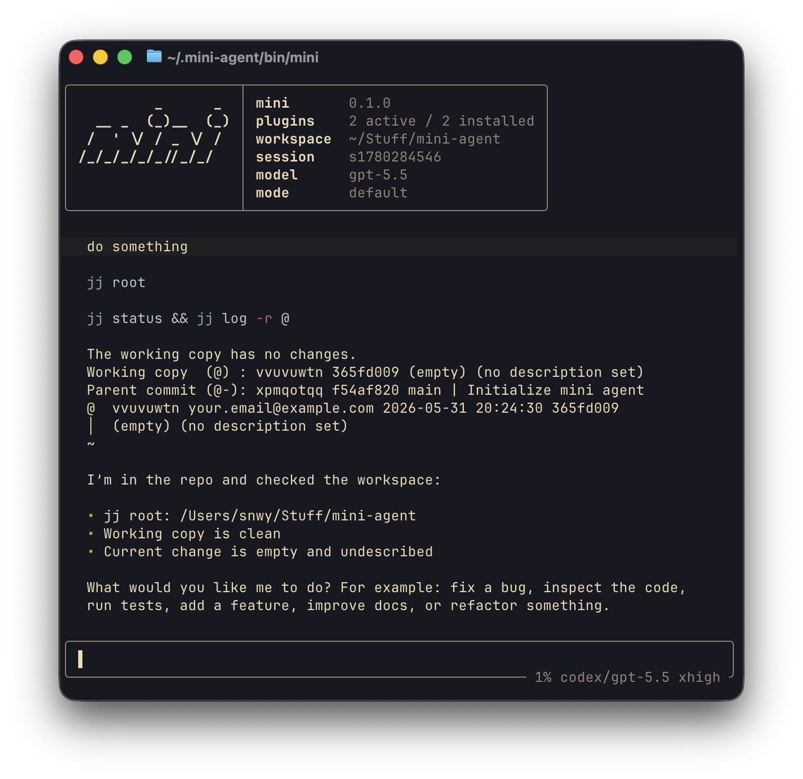

# mini

`mini` is a small Rust terminal coding agent with a full-screen TUI,
non-interactive print mode, provider adapters, editable Markdown modes, and
Markdown plugins that can install helper scripts.



## Highlights

- **Interactive TUI** by default; `mini -p` for non-interactive print mode.
- **Provider adapters** for Codex, OpenAI, OpenRouter, Anthropic, and Gemini.
- **Editable modes and plugins** stored in `~/.mini-agent`.
- **Plugin-installed helper scripts** under `~/.mini-agent/bin`.
- **Session persistence and resume** for TUI conversations.
- **Context compaction** with manual `/compact` and automatic thresholding.
- **Bundled plugins** for Jujutsu, subagents, project memories, and Codex
  Computer Use.

## Quick start

Install from crates.io:

```sh
cargo install viridian-mini
```

The installed binary is named `mini`:

```sh
mini
mini -p "summarize this repository"
mini --help
```

For development, install or run from a checkout:

```sh
cargo install --path .
cargo run
cargo run -- -p "summarize this repository"
```

On first startup, `mini` creates editable defaults if they do not exist:

```text
~/.mini-agent/config.toml
~/.mini-agent/modes/default.md
~/.mini-agent/modes/shell.md
~/.mini-agent/modes/review.md
~/.mini-agent/plugins/
```

The first interactive run also asks whether to install and enable the bundled
plugins. Seeded files are not overwritten, so edit them directly to customize
future sessions.

## Common commands

### Interactive TUI

```sh
mini
mini --resume              # resume latest session
mini --resume <session-id>
mini --session my-session  # force a session id
mini -m review             # use a mode
mini --plugin jj           # add a plugin for this run
```

Useful slash commands inside the TUI:

```text
/help
/provider [name]
/model [name]
/model add <name>
/mode [name]
/effort [none|on|minimal|low|medium|high|xhigh|custom]
/session
/resume [session]
/reload
/compact
/compact status
```

The status bar shows context usage immediately before the model slug, for
example:

```text
12% codex/gpt-5.5
```

### Print mode

Use `-p/--print` for one-shot runs:

```sh
mini -p "summarize this repository"
mini -p --output-format json "summarize this repository"
mini -p --output-format stream-json "summarize this repository"
mini -p --yolo "make the requested change"
```

`--output-format` supports:

- `text`
- `json`
- `stream-json`

`--input-format` supports:

- `text`
- `stream-json`

For `--input-format stream-json`, stdin is newline-delimited JSON user messages:

```json
{"type":"user","message":{"role":"user","content":[{"type":"text","text":"Explain this code"}]}}
```

### Prompt and plugin inspection

```sh
mini --explain-prompt
mini --explain-prompt --plugin examples/plugins/jj.md
mini --check-plugins --plugin examples/plugins/memories.md
mini --ignore --check-plugins --plugin examples/plugins/jj.md
```

`--ignore` skips supported non-fatal plugin load/render errors. `--yolo`
answers yes to confirmations.


## Miniscient server

`miniscient` is an always-on local server that reuses `mini-agent-core` but keeps
its own home directory under `~/.miniscient`. It is intended for out-of-process
connectors such as SMS listeners, Telegram bots, or other small bridge programs.
Those connectors can call the local HTTP interface instead of embedding agent
logic.

> **Security:** the server has no authentication and `POST /message` runs the
> full agent loop, including model-issued `bash` commands. Treat any client that
> can reach the socket as fully trusted. Keep `--listen` bound to a loopback
> address (`127.0.0.1`), never expose it to a network, and only run trusted
> connectors against it.

Start the server:

```sh
cargo run -p miniscient -- serve --listen 127.0.0.1:47873
```

If you use the Codex provider, authenticate separately for `~/.miniscient`:

```sh
cargo run -p miniscient -- auth login
```

Example connector request:

```sh
curl -s http://127.0.0.1:47873/message \
  -H 'content-type: application/json' \
  -d '{"type":"message","text":"what should I do next?"}'
```

Useful endpoints:

- `GET /health`
- `GET /status`
- `GET /history`
- `POST /message` with `{"type":"message","text":"..."}`
- `POST /reload`
- `POST /clear`
- `POST /rpc` with any request object

Responses are JSON envelopes with `ok`, `result`, and `error` fields. Message
responses include the final assistant text plus structured events for assistant
deltas, tool use/results, and compaction.

### iMessage adapter

An example macOS iMessage connector lives at
`examples/adapters/miniscient-imessage.sh`. It polls the local Messages database,
forwards allowed inbound messages to `miniscient`, and replies through Messages
using AppleScript. A standalone Python port with the same flags lives alongside
it at `examples/adapters/miniscient-imessage.py`; pick whichever fits your
environment.

```sh
examples/adapters/miniscient-imessage.sh --allow +15551234567
```

The adapter requires Full Disk Access for the process that runs it so it can
read `~/Library/Messages/chat.db`, and Automation permission to control
Messages. Use `--print-only` to test without sending replies.

### Mounting MCP servers

`miniscient` can mount [Model Context Protocol](https://modelcontextprotocol.io)
servers and expose their tools to the agent alongside the built-in `bash` tool.
Configure servers in `~/.miniscient/mcp.toml`:

```toml
# A local server over stdio (launched as a subprocess):
[servers.filesystem]
command = "npx"
args = ["-y", "@modelcontextprotocol/server-filesystem", "/Users/me/projects"]
# env = { SOME_TOKEN = "..." }   # optional environment for the subprocess

# A remote server over Streamable HTTP:
[servers.docs]
url = "https://example.com/mcp"
# headers = { Authorization = "Bearer ..." }   # optional request headers
```

A plugin can also bundle the MCP server it needs by declaring an `[mcp]` table
in its front matter, so a capability ships as one file (prompt guidance plus its
server):

```md
+++
id = "websearch"
title = "Web Search (MCP)"
type = "plugin"

[mcp.web]
command = "npx"
args = ["-y", "some-web-search-mcp"]
+++

Use the `web__*` tools to search the web.
```

Plugin-declared servers are merged with `mcp.toml` (a name already set in
`mcp.toml` wins). This works under `miniscient` (which has the MCP client); under
`mini` the `[mcp]` table is inert and only the prose applies.

The bundled `codex-computer-use` plugin declares the Codex app's built-in
Computer Use MCP server on macOS. With Codex.app installed and permissions
approved, enable it in `~/.miniscient/config.toml`:

```toml
[agent]
plugins = ["codex-computer-use", "memories"]
```

Restart `miniscient`; its tools mount as `computer-use__list_apps`,
`computer-use__get_app_state`, `computer-use__click`, and so on.

On startup `miniscient` connects to each server, runs the MCP handshake, and
mounts every tool it advertises. Tool names are namespaced as
`<server>__<tool>` (e.g. `filesystem__read_file`) so tools from different
servers cannot collide. A server that fails to connect is logged and skipped;
the agent still starts.

The mounted tools appear in `GET /status` under `tools`:

```sh
curl -s http://127.0.0.1:47873/status   # -> { ..., "tools": ["filesystem__read_file", ...] }
```

Both stdio and Streamable HTTP transports are supported. MCP machinery lives
entirely in `miniscient`; `mini-agent-core` only defines the `Tool` trait that
any front-end can implement.

Notes: each MCP request is bounded by a timeout so a stalled server cannot wedge
the agent, and a failing tool is reported back to the model (it can retry).
`POST /reload` re-applies config and plugins but keeps existing MCP connections;
restart `miniscient` to pick up `mcp.toml` changes or to reconnect a server that
has exited.

## Configuration

Main config lives at `~/.mini-agent/config.toml`:

```toml
[agent]
default_mode = "default"
plugins = ["jj", "subagents", "memories"]
auto_compact = true
compact_threshold = 0.7
compact_keep_recent = 20
# context_window_tokens defaults to 128000 when unset.
# context_window_tokens = 200000

[model]
provider = "codex"
model = "gpt-5.5"
# max_output_tokens = 12000
# temperature = 0.2
# reasoning_effort = "medium"
```

Values in `[model]` select the active provider and model. Provider profiles can
be overridden there for local experiments.

## Models and providers

Built-in providers:

| Provider | Protocol | Auth |
| --- | --- | --- |
| `codex` | `openai-responses` | Codex OAuth |
| `openai`, `openai-responses` | `openai-responses` | `OPENAI_API_KEY` |
| `openai-chat-completions`, `openai-completions` | `openai-chat-completions` | `OPENAI_API_KEY` |
| `openrouter` | `openai-chat-completions` | `OPENROUTER_API_KEY` |
| `anthropic` | `anthropic` | API key |
| `gemini` | `gemini` | API key |

Protocol values are `openai-responses`, `openai-chat-completions`,
`anthropic`, and `gemini`. Auth values are `api-key`, `codex-oauth`, and
`none`.

Custom providers live under `[providers.<name>]`:

```toml
[model]
provider = "work-router"
model = "anthropic/claude-sonnet-4.5"

[providers.work-router]
protocol = "openai-chat-completions"
base_url = "https://openrouter.ai/api/v1"
api_key_env = "OPENROUTER_API_KEY"

[providers.local]
protocol = "openai-chat-completions"
base_url = "http://127.0.0.1:11434/v1"
auth = "none"
```

`reasoning_effort` accepts values such as `minimal`, `low`, `medium`, and
`high`, depending on the model.

### Codex OAuth

The built-in `codex` provider uses a stored OpenAI Codex OAuth login:

```sh
mini auth login
mini auth status
mini auth logout
```

`auth login` opens the browser and stores tokens in `~/.mini-agent/auth.json`.

## Runtime behavior

The model can call a `bash` tool. `mini` executes the requested command in the
current workspace and feeds the result back to the model. The loop continues
until the assistant returns a final message.

## Context compaction

`mini` can compact long conversations into a continuation summary that persists
with the session.

Config:

```toml
[agent]
auto_compact = true
compact_threshold = 0.7
compact_keep_recent = 20
# context_window_tokens defaults to 128000 when unset.
# context_window_tokens = 200000
```

TUI commands:

```text
/compact          # compact now
/compact status   # show estimated context, window, threshold, and retention
```

The status bar context percentage uses the same estimate.

## Plugins

A plugin is a Markdown file with TOML front matter:

```md
+++
id = "jj"
title = "Jujutsu Workspace Discipline"
type = "plugin"

[commands.jj]
command = "jj"
required = true
reason = "The jj plugin needs the `jj` binary in PATH."
+++

# Jujutsu Workspace Discipline

Use `jj` for workspace isolation. At the start of the session, run `jj root`.
```

Installed plugins live under `~/.mini-agent/plugins` and can be referenced by id:

```sh
mini --plugin jj
mini plugin add <url-or-path>
mini plugin update [id]
mini plugin list
mini plugin info <id>
mini plugin rm <id>
```

Plugins listed in `[agent].plugins` are active by default. `--plugin` adds a
plugin for the current run.

### Modes

Modes use the same file format with `type = "mode"` and replace the base system
prompt:

```md
+++
id = "review"
title = "Review"
type = "mode"
+++

You are mini in code review mode. Prioritize concrete bugs and missing tests.
```

### Plugin templates

Plugin bodies are rendered with MiniJinja. Available template values:

- `cwd`: current working directory
- `plugin`: plugin metadata
- `commands.<name>.exists`: whether an optional or required command is available
- `plugins.<id>.exists`: whether another loaded plugin is active

Required command probes fail before the prompt is composed. Plugin prompts are
rendered once at session start and kept stable for that session.

### Installed scripts

Plugins can bundle helper scripts. A fenced block with `install=name` is
installed as `~/.mini-agent/bin/name` when the plugin is active:

````md
```bash install=ma-example
#!/usr/bin/env bash
set -euo pipefail
echo "hello from a plugin script"
```
````

Installed script blocks are removed from the rendered prompt. `mini` tracks
installed names under `~/.mini-agent/state/scripts`, removes stale scripts when a
plugin changes, and refuses untracked overwrites unless `--yolo` is set.

## Bundled plugins

### `jj`

Adds Jujutsu workspace instructions and requires the `jj` command.

### `subagents`

Installs a `subagents` helper for bounded child-agent tasks:

```sh
subagents -- "Inspect the parser and report the files involved."
subagents background --name parser-scan -- "Inspect parser state and summarize."
subagents status parser-scan
subagents wait parser-scan
subagents show parser-scan
```

With the `jj` plugin active, background subagents get isolated jj workspaces.

### `memories`

Installs `memories` plus a `memory` alias for project-local persistent notes
under `.mini/memories/`:

```sh
memories add thoughts/food "i like hamburger"
memories add project/test-command "cargo check -q"
memories ls
memories show thoughts/food
memories rm thoughts/food
```

`memories add` writes the path exactly, adding `.md` when omitted. The first
example writes:

```text
.mini/memories/thoughts/food.md
```

`memories ls` prints a tree-like hierarchy.

### `codex-computer-use`

Declares the Codex app's bundled Computer Use MCP server for Miniscient. It does
not install a helper script; Miniscient mounts the MCP server directly and exposes
tools with the `computer-use__` prefix.

## Repository layout

```text
src/main.rs              `mini` binary: CLI, print mode, auth and plugin commands
crates/mini-agent-core/  prompt composition, config, model protocols, plugins
crates/mini-agent-tui/   interactive terminal UI, sessions, slash commands
crates/miniscient/       always-on local agent server for connectors
examples/modes/          browsable copies of crates/mini-agent-core/assets/modes
examples/plugins/        browsable copies of crates/mini-agent-core/assets/plugins
examples/adapters/       example connectors for the miniscient server
```

The bundled modes and plugins are compiled into the binary from
`crates/mini-agent-core/assets/` via `include_str!`; the `examples/` copies are
for browsing and `--plugin path/to.md` use.

## Development

```sh
cargo fmt
cargo check -q
cargo run -- --check-plugins --plugin examples/plugins/memories.md
```

Useful local runs:

```sh
cargo run -- --explain-prompt
cargo run -- -p --output-format stream-json "say hi"
cargo run -- auth status
```
